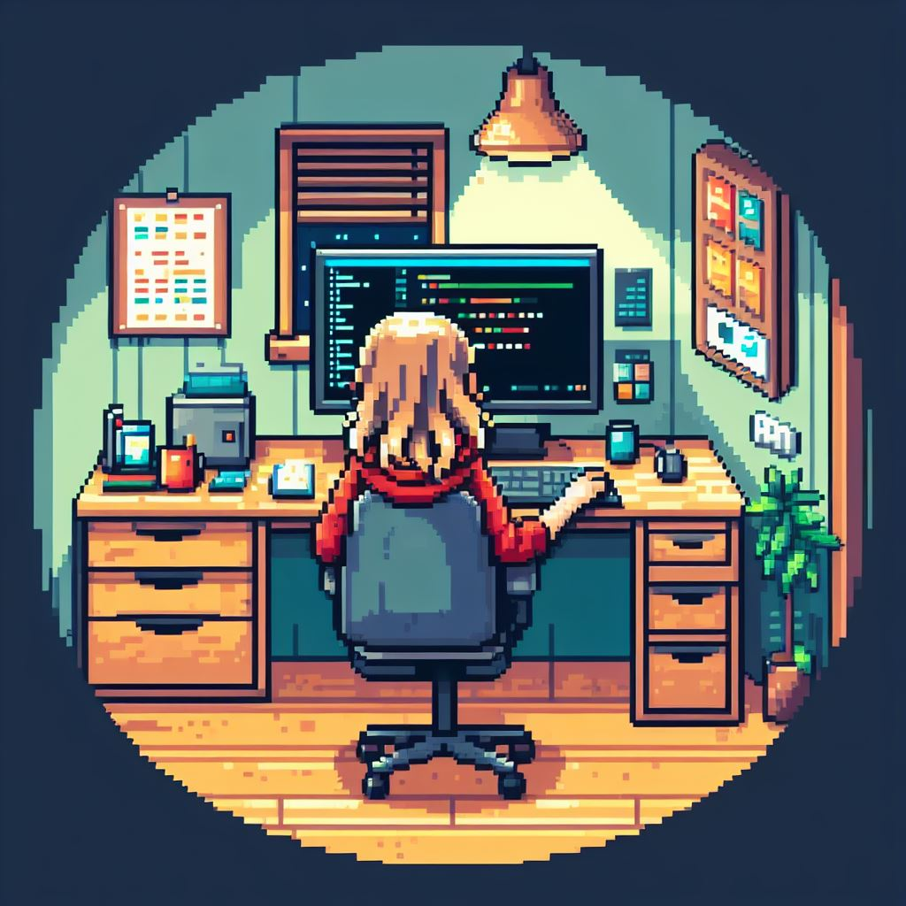

  
<!-- BORDA 

-->

<!-- LETREIRO --> 
 
 
 

<!-- CONTATOS -->

 

 

<!-- GATINHO -->
  

 
 
<!-- SOBRE -->
<pre>
<pre>
  
Turning ideas into functional and scalable products.

Bridging development and customer experience.
  

🔸 Mono Kassadin, sushi lover & series binge-watcher
  

Main stack:

🔸 TypeScript • Next
  

Exploring:

🔸 Architectures & scalable systems
  

Currently building at:

🔸 https://www.comuniverso.co/  
</pre>

</pre>

<!--

<pre>
  
🔸 Mono Kassadin, apreciadora de sushi e maratonista de séries.

Em andamento: 
  
🔸 2024: Engenharia de Software pela Universidade Unopar Anhanguera.

 Concluidos:

🔸 2025: Formação Fullstack com Java, JUnit, 
  Javascript, Jest, HTML, CSS, PostgrSQL 
  pela CWI no programa Crescer Lvl. 1.

🔸 2025: Bootcamp ONP. Desenvolvimento de e-commerce com Next.js, 
  metodologias ágeis (Daily, Sprint Review, Code Review), 
  experiência prática com servidores de desenvolvimento, homologação e produção, 
  além de colaboração com PO e QA.
  
🔸 2024: Developer Fullstack Júnior com React, Design, 
   Testes Unitários com Jest, Java, MySQL, Spring Boot, JPA, JUnit 
   pela +PraTi em parceria com a Codifica Edu.
  
🔸 2024: TreinaDev 12, TDD com Ruby on Rails, RSpec, Capybara
   pela Campus Code.

🔸 2023: Desenvolvimento Backend com JavaScript, Node.js, Express.js e PostgreSQL 
   pela Cubos Academy em parceria com iFood.

🔸 2023: Desenvolvimento Fullstack com Angular, C# e .Net 
   pela Ímã Tech em parceria com a MXM Sistemas. 
</pre>
-->

  
<!--
 
   
  
### 🔸 I dev with 🔸
-->

<!-- SKILLS -->

<!-- 

 -->
<!-- 

 -->
<!-- 

 -->
<!-- 

 -->
<!--  // aqui esta faltando JUnit, xUnit e React Testing Library -->

<!--
### 🔸 Familiar but less used 🔸 

-->

<!-- STUDYING -->
<!--
### 🔸 Studying in this moment 🔸

 

 
 
 
-->

 <!--
### 🔸 Next on the list 🔸

 --> 

<!-- STATUS --> 

<!--  
  -->
 
 
 
 

👾

  <!--
  graphql,vue,redis,mongo
  aws,azure,cypress,selenium
  jasmine,karma,xunit
  replit
  prisma,nestjs,
  supabase,firebase
  clojure,elixir,rust,dart,flutter,electron,unity,
  rspec,capybara
  https://skillicons.dev/
  https://techstack-generator.vercel.app/ 
 --> 

 
 

<!-- CODEWARS -->
<!-- 

 
 
-->

<!-- PROJECTS
### Main Projects
 Se gostar deixe uma estrela ⭐️
|  |  |
|:---:|:---:|
| [um-jogo](https://github.com/marina-barbosa/Um-Jogo)   /   [Jogar agora!](https://marina-barbosa.github.io/Um-Jogo/) | [CRUD banco digital](https://github.com/marina-barbosa/Banco-Digital-API-CRUD-RESTful) |
 

 -->

 
 
<!--  -->

<!-- 

FOOTER

 -->

