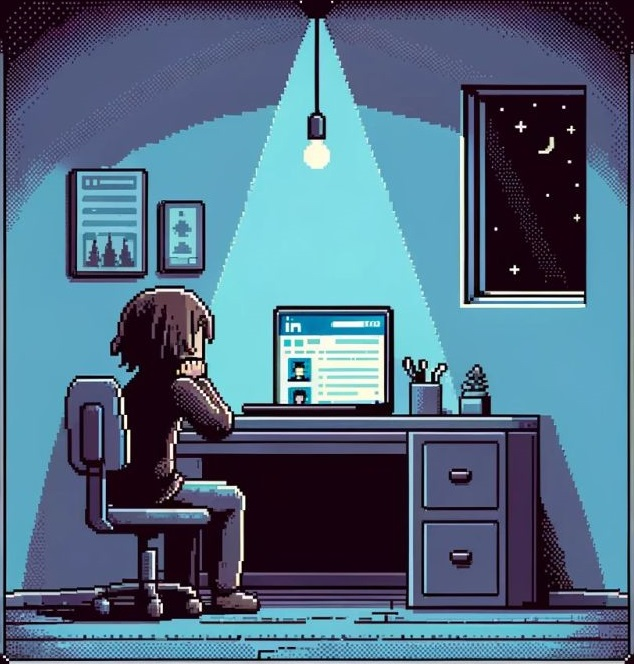

  
<!-- BORDA 

-->

<!-- LETREIRO --> 
 
 
 

<!-- CONTATOS -->

 

 

<!-- GATINHO -->
  

 
 
<!-- SOBRE -->
<pre>
  
🔸 Mono Kassadin, apreciadora de sushi e maratonista de séries.

Em andamento: 

🔸 2024: Developer Fullstack Júnior com React, Redux, Design, 
   Testes Unitários com Jest e React Testing Library, 
   Java, MySQL, Spring Boot, JPA, 
   Testes de Unidade e Integração com JUnit e Mockito, 
   Scrum, Kanban e CI/CD 
   pela PraTi em parceria com a Codifica Edu.

🔸 2024: TreinaDev 12, TDD com Ruby on Rails e Vue.js 
   pela Campus Code.

Certificados: 

🔸 2023: Desenvolvimento Backend com JavaScript, Node.js, Express.js e PostgreSQL 
   pela Cubos Academy em parceria com iFood.

🔸 2023: Desenvolvimento Fullstack com Angular, C# e .Net 
   pela Ímã Tech em parceria com a MXM Sistemas.

</pre>

 
   
  
### 🔸 I code with 🔸

<!-- SKILLS -->

<!-- STATUS --> 
 
 
 

👾

<!-- STUDYING -->
### 🔸 Studying in this moment 🔸

  <!--
  prisma,jestjs,nestjs,react,java,spring,mongodb,rails,redis,replit,tailwind
  aws,clojure,elixir,golang,rust,dart,flutter,docker,electron,firebase,next,unity,
  https://skillicons.dev/
  https://techstack-generator.vercel.app/ 
 --> 
 
 

<!-- CODEWARS -->

 

<!-- PROJECTS
### Main Projects
 Se gostar deixe uma estrela ⭐️
|  |  |
|:---:|:---:|
| [um-jogo](https://github.com/marina-barbosa/Um-Jogo)   /   [Jogar agora!](https://marina-barbosa.github.io/Um-Jogo/) | [CRUD banco digital](https://github.com/marina-barbosa/Banco-Digital-API-CRUD-RESTful) |
 

 -->

 

<!-- 

FOOTER

 -->

